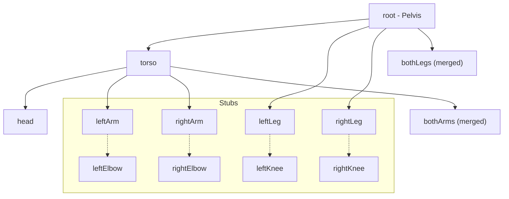

# See-through PSD Rigger: Architecture Overview

The See-through PSD Rigger is a tool designed to take a layered PSD (from the See-through spec) and provide a skeletal rigging system for posing. It moves from static layers to a dynamic, hierarchical transformation system.

## Core Components

### 1. Project State (`state`)
The application maintains a central state object containing all project data:
- `psd`: The original PSD object from `ag-psd`.
- `layerMap`: A dictionary mapping normalized layer tags (e.g., `face`, `topwear`) to PSD layer objects.
- `layerList`: A flattened array of layers in back-to-front rendering order.
- `skeleton`: A dictionary of keypoints (joints) in image space (e.g., `neck`, `lShoulder`).
- `bones`: A dictionary of bone objects containing hierarchy and transformation data.
- `irisOffset`: An `{x, y}` object for independent eye movement.

### 2. Layer Tagging
Layers are identified by their names in the PSD. The system looks for specific "tags" to categorize layers into body parts.

| Group | Normalized Tags |
| :--- | :--- |
| **Head** | `face`, `front hair`, `headwear`, `nose`, `mouth`, `eyewhite`, `irides`, `eyelash`, etc. |
| **Torso** | `topwear`, `neckwear` |
| **Arms** | `handwear-l`, `handwear-r` (split) or `handwear` (merged) |
| **Legs** | `legwear-l`, `legwear-r` (split) or `legwear` (merged) |
| **Feet** | `footwear-l`, `footwear-r` (split) or `footwear` (merged) |
| **Root** | `bottomwear`, `tail`, `wings`, `objects` |

## Bone Hierarchy

The rigger uses a tree-based hierarchy where child transforms are influenced by their parents.



### Bone Data Structure
Each bone in the `state.bones` dictionary follows this schema:
```javascript
{
  name: string,
  parent: string | null,
  pivot: { x: number, y: number }, // Image-space coordinates
  rot: number,                     // Rotation in degrees
  tx: number,                      // Local X translation
  ty: number                       // Local Y translation
}
```

## Workflow Summary
1. **Load PSD**: Read layers and map them to tags.
2. **Auto-Rig**: Establishes initial joint positions (Skeleton).
3. **Build Bones**: Converts skeleton joints into a hierarchy of bones with pivots.
4. **Pose**: User modifies `rot`, `tx`, `ty` values via sliders or trackpads.
5. **Render**: Hierarchy is traversed to compute global matrices and draw layers.
